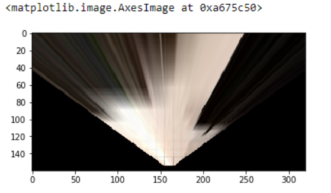
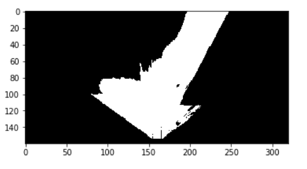
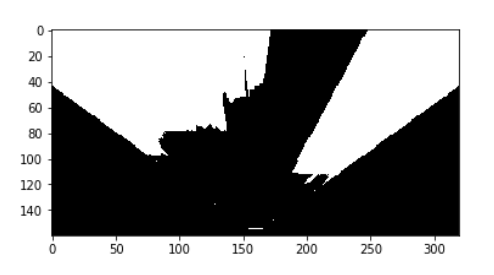
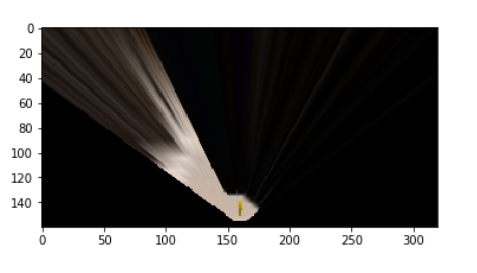
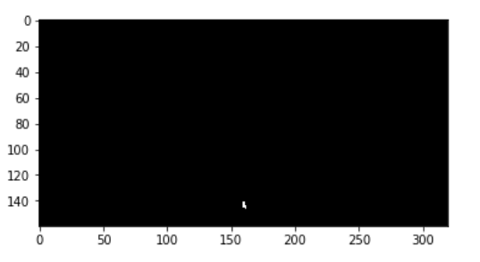
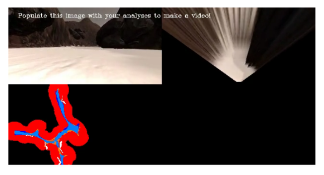

# Project 1: SEARCH AND SAMPLE RETURN

## OBSTACLE AND ROCK IDENTIFICATION IN JUPYTER NOTEBOOK

To identify the obstacles and rocks in a given image, I modified the given function color_thresh:
1. To store the threshold of the navigable, obstacle , and rocks I created three separate numpy array of zeros as the same size as that of the image.
2. Threshold value of RGB for navigable path, obstacle, and obstacle was selected to be (160,160,160), (140,140,140) and (125,125,50), with relational operations as shown in the notebook.
3. The zero numpy arrays defined in the first step is assigned with value of 1 for the pixels where the conditionals are satisfied.
4. For obstacle threshold, only pixels that lie within the angular range same as that of the warped image.

## Result:

### Warped Image

### Navigable Threshold Image

### Obstacle Threshold Image

### Sample Warped Image

### Sample Threshold Image

## UPDATING PROCESS IMAGE FUNCTION IN JUPYTER NOTEBOOK

Modifications made to the process image function:
1. Defined source and destination points to perform perspective transform.
2. Applied perspective transform to get warped and masked image.
3. Applied color_thresh function on the warped image to get threshold images of navigable, obstacle and rocks.
4. Converted the threshold of navigable obstacle, and rock to the rover coordinates.
5. Extracted data regarding the x,y coordinates of the rover world position, and the yaw angle of the rover. Used this information and rover coordinates of threshold to convert the pixels from rover centric coordinates to world centric coordinates by applying 2D rotation transformation followed by the translation transformation on the rover centric coordinates.
6. To create the worldmap separating navigable path from obstacles, I first created another array (worldmap_count) same as worldmap in the Databucket classs.
7. Updated the worldmap_count layers with coordinates corresponding to navigable path, obstacles, and rock respectively. For rock, all the three layers are assigned the pixel value of 255 so it appears white in the worldmap. Whereas for navigable and obstacle the worldmap_count for the given set of coordinates is updated by 1 and 1 respectively.
8. Using a decision tree, I compared the count in a pixel for the navigable path with the obstacle layer, and whichever was greater I assigned that pixel the value of 255 in the world map array and 0 to the smaller one.

### Result

# Autonomous Navigation And Mapping

## Perception Step

Lot of the perception step is same as that of the process_image function in the jupyter notebook.

1. Defined source and destination points to perform perspective transform.
2. Applied perspective transform to get warped and masked image.
3. Applied color_thresh function on the warped image to get threshold images of navigable, obstacle and rocks.
4. Store the threshold in the variable - vision_image of the Rover class.
5. Converted the threshold image of navigable obstacle, and rock to the rover coordinates. For obstacles converted only those pixels which are common to obstacle threshold and mask image.
6. Extracted information about the x position, y position, yaw from the Rover class.
7. Used the above information and rover coordinates of navigable path, obstacles, and rock threshold to convert the pixels from rover centric coordinates to world centric coordinates by applying 2D rotation transformation followed by the translation transformation on the rover centric coordinates.
8. Update the worldmap for navigable path and obstacles only if the Rover pitch and roll angle lies between the specified range, so as to map accurately. Updating the rock layers without the above conditions so that we don’t miss the location of the rock, even if the Rover angle isn’t satisfying the pitch and roll constraints.
9. Convert the pixels of the navigable path to polar form, and storing the angle and distance in two variables - Rover.angles & Rover.dist of the class Rover.
10. Convert the pixels of the rocks to polar form, and storing the angle and distance in two variables - Rover.rock_angles & Rover.rock _dist of the class Rover.

## Decision Step

### To avoid the Rover from going in circles for forever.
1. First check if the steer angle of the Rover is 15 or -15.
2. If it is, then check whether the velocity is greater than 0.2 as I wanted to separate the situation from turning around situation when the Rover has encountered some obstacles.
3. Check if the variable Rover.frame_time is 0, if it is then assign the variable as time.time(), this would be the start of the this event.
4. Next, I checked whether the variable Rover.frame_time is zero or not, as if the variable is zero the steer event corresponding to 15 or -15 has never been started.
5. If the Rover.frame_time is not zero then I again checked for steer angle is equal to 15 or -15, if it is not the I reassigned the Rover.frame_time to zero.
6. If the Rover.steer is equal to 15 or -15 then I checked for the condition where the current time minus the Rover.frame_time has exceeded a certain specified time. (delta_time = time.time() - Rover.frame_time)
7. If delta_time as exceeded the specified value, then Rover.throttle is set to zero and Rover.brake is set to Rover.brake_set. Further if the current steer is 15 then the Rover is assigned steer of -10 and vice versa, so as to avoid the Rover from getting caught in the roundabout.
8. Finally the function return the current state of the Rover.

### To avoid the Rover from getting stuck at a single forever.
1. First check if the absolute Rover velocity is less than 0.1.
2. Check if the variable Rover.stuck_time is 0, if it is then assign the variable as time.time(), this would be the start of the this event.
3. Next, I checked whether the variable Rover.stuck_time is zero or not, if the variable is zero the steer event corresponding to absolute Rover velocity less than 0.1  has never been started.
if Rover.stuck_time is not zero, then check for absolute Rover Velocity less than 0.1 or not. If it is not then reset the Rover.stuck_time to zero to mark the end of the event.
4. If the absolute Rover velocity is less than 0.1 then I checked for the condition where the current time minus the Rover.stuck_time has exceeded a certain specified time. (delta_time = time.time() - Rover.stuck_time)
5. If delta_time as exceeded the specified value, then Rover.throttle and Rover.brake are set to zero. The Rover.steer is set to -15. 6. 6. Further if the delta_time exceeds a certain value then steer is set to zero and throttle is set to 0.2. This is done to avoid the Rover from turning about its current location forever. 
7. Finally the function return the current state of the Rover.

# Running The drive_rover.py Python Script

On running the script, the program does a decent job of mapping the environment and maintaining fidelity over 60%. Improvements can be made to stabilize the rover as in situations when the steer angle changes dramatically thereby causing the roll and pitch to change. The fidelity can also be improved by modifying the mapping lines in the supporting function script. 

